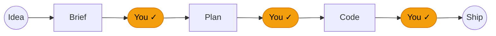

# Claude Goodies

**An opinionated, human-in-the-loop workflow for [Claude Code](https://claude.ai/code).** Turns a rough feature idea into shipped, reviewed, committed code — without you babysitting every step, and without letting Claude ship blind.

Skills, commands, and one adversarial review agent. Every piece explained with a worked example in the [interactive handout](https://user538295.github.io/claude_goodies/handout/) (English · [Magyar](https://user538295.github.io/claude_goodies/handout/index-hu.html)).


> `/feature-refinement` → `/plan-maker` → `/implement-next` — idea to commit in one session. [`/implement-all`](https://user538295.github.io/claude_goodies/handout/cmd-implement-all.html) runs the full plan unattended.

---

## The shape of it



Three human gates, everything else automated. The full 9-step pipeline lives in the handout: [agentic-workflow-en.html](https://user538295.github.io/claude_goodies/handout/agentic-workflow-en.html) · [agentic-workflow-hu.html](https://user538295.github.io/claude_goodies/handout/agentic-workflow-hu.html).

---

## What it gives you

Each entry links to its handout page with a worked example.

### Ship a feature, start to finish

- [**`/feature-refinement`**](https://user538295.github.io/claude_goodies/handout/cmd-feature-refinement.html) — Turn a rough idea into a brief you can hand off. A senior product thinker walks you through the questions you'd otherwise skip.
- [**`/plan-maker`**](https://user538295.github.io/claude_goodies/handout/skill-plan-maker.html) — Stop staring at a ticket wondering where to start. Breaks the brief into the smallest tasks with tests and dependencies.
- [**`/implement-all`**](https://user538295.github.io/claude_goodies/handout/cmd-implement-all.html) — Have a finished plan? Walk away and let it ship. Runs `/implement-next` in a loop — one task, one commit at a time.
- [**`/implement-next`**](https://user538295.github.io/claude_goodies/handout/cmd-implement-next.html) — Or just do the next task and stop. Builds test-first, reviews itself, commits.

### Get a second opinion

- [**`/da-review`**](https://user538295.github.io/claude_goodies/handout/cmd-da-review.html) — A second opinion that actually pushes back. One-pass devil's-advocate review, no auto-fixes.
- [**`/iterative-review`**](https://user538295.github.io/claude_goodies/handout/cmd-iterative-review.html) — A review that doesn't stop at finding problems. Reviewers and fix agents loop until clean.
- [**`/aaa`**](https://user538295.github.io/claude_goodies/handout/skill-aaa.html) — When "looks good to me" isn't enough. Benchmarks an idea against world-class and hands you 3–4 concrete upgrade paths.

Powered by the [`devils-advocate`](https://user538295.github.io/claude_goodies/handout/agentic-workflow-en.html#da) agent — the thing actually doing the attacking. Auto-invoked by both review commands and inside `/implement-next`.

### Make Claude remember

- [**`/llm-wiki`**](https://user538295.github.io/claude_goodies/handout/skill-llm-wiki.html) — You've done the research, but Claude keeps forgetting it. Captures notes, sources, decisions; future chats search it first → sharper answers, fewer tokens.
- [**`/llm-wiki-product`**](https://user538295.github.io/claude_goodies/handout/skill-llm-wiki-product.html) — Know exactly where you lose to competitors. Track rivals; get back a value-vs-effort backlog of gaps to close.

### Wrangle docs and skills

- [**`/documentation-standard`**](https://user538295.github.io/claude_goodies/handout/skill-documentation-standard.html) — Docs your team will actually find again. Enforces structure across architecture notes, ADRs, manuals, and dev guides.
- [**`/skill-packager`**](https://user538295.github.io/claude_goodies/handout/skill-skill-packager.html) — Built a Claude Code skill? Make it work in Claude Desktop too. Packages your folder into an upload-ready ZIP.

Two script bundles handle the plumbing — [`scripts-plan`](https://user538295.github.io/claude_goodies/handout/scripts-plan.html) enforces one-commit-per-task and audits finished runs; [`scripts-logging`](https://user538295.github.io/claude_goodies/handout/scripts-logging.html) archives every prompt as per-project Markdown so you never lose a conversation.

---

## Install · Update

Paste this into Claude Code — works for both fresh installs and updates:

```
Fetch https://raw.githubusercontent.com/user538295/claude_goodies/main/install-prompt.md and follow the installation instructions it contains.
```

Claude fetches the installer, clones the latest repo, copies everything into `~/.claude/`, and cleans up after itself. For updates, existing files are overwritten with the latest versions; your `CLAUDE.md` is never touched without showing a diff and asking for your approval first. Restart Claude Code (or start a new session) for changes to load.

---

## The opinions baked in

Everything ships with a `CLAUDE.md` that Claude Code loads at the start of every session. It encodes four principles:

1. **Think before coding.** State assumptions, surface tradeoffs, push back when warranted.
2. **Simplicity first.** Minimum code that solves the problem; nothing speculative.
3. **Surgical changes.** Touch only what the task requires.
4. **Goal-driven execution.** Define success upfront and loop until verified.

And enforces: tests before code (85%+ coverage), warning-free codebase at all times, one commit per plan task, no batching multiple tasks into a single agent run.

The installer diffs your existing `~/.claude/CLAUDE.md` against this one and asks before merging — it will never overwrite without approval.

If that's not your speed, this repo isn't for you. If it is — install in 30 seconds.

---

## Requirements

- [Claude Code](https://claude.ai/code) (CLI, desktop app, or IDE extension).
- macOS or Linux (shell scripts use bash and awk).
- Git (used by the commit-verification scripts).

No MCP servers required.

---

Full reference, with worked examples for every skill, command, agent, and script — open the handout:
**[English](https://user538295.github.io/claude_goodies/handout/) · [Magyar](https://user538295.github.io/claude_goodies/handout/index-hu.html)**.
