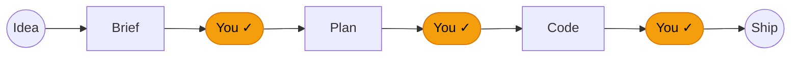

# Claude Goodies

**An opinionated, human-in-the-loop workflow for [Claude Code](https://claude.ai/code).** Turns a rough feature idea into shipped, reviewed, committed code — without you babysitting every step, and without letting Claude ship blind.

Skills, commands, and one adversarial review agent. Every piece explained with a worked example in the [interactive handout](https://user538295.github.io/claude_goodies/handout/) (English · [Magyar](https://user538295.github.io/claude_goodies/handout/index-hu.html)).


> `/feature-refinement` → `/plan-maker` → `/implement-next` — idea to commit in one session. [`/implement-all`](https://user538295.github.io/claude_goodies/handout/cmd-implement-all.html) runs the full plan unattended.

---

## The shape of it


```mermaid
flowchart LR
    A((Idea)) --> B[Brief] --> G1([You ✓]):::gate --> C[Plan] --> G2([You ✓]):::gate --> D[Code] --> G3([You ✓]):::gate --> E((Ship))
    classDef gate fill:#f59e0b,color:#000,stroke:#d97706
```

Three human gates, everything else automated (simplified default view; see the full handout for the 4-gate detailed pipeline). The full 9-step pipeline lives in the handout: [agentic-workflow-en.html](https://user538295.github.io/claude_goodies/handout/agentic-workflow-en.html) · [agentic-workflow-hu.html](https://user538295.github.io/claude_goodies/handout/agentic-workflow-hu.html).

---

## What it gives you

Each entry links to its handout page with a worked example.

### Ship a feature, start to finish

- [**`/feature-refinement`**](https://user538295.github.io/claude_goodies/handout/skill-feature-refinement.html) — Turn a rough idea into a brief you can hand off. A senior product thinker walks you through the questions you'd otherwise skip.
- [**`/plan-maker`**](https://user538295.github.io/claude_goodies/handout/skill-plan-maker.html) — Stop staring at a ticket wondering where to start. Breaks the brief into the smallest tasks with tests and dependencies.
- [**`/implement-all`**](https://user538295.github.io/claude_goodies/handout/cmd-implement-all.html) — Have a finished plan? Walk away and let it ship. Runs `/implement-next` in a loop — one task, one commit at a time.
- [**`/implement-next`**](https://user538295.github.io/claude_goodies/handout/cmd-implement-next.html) — Or just do the next task and stop. Builds test-first, reviews itself, commits.
- [**`/quick-plan`**](https://user538295.github.io/claude_goodies/handout/skill-quick-plan.html) — No plan yet and too busy for `/plan-maker`. Defines the goal, success criteria, and 4–12 steps inline — one pass, no file written.
- [**`/commit`**](https://user538295.github.io/claude_goodies/handout/skill-commit.html) — Commit time. Reads the staged diff, writes a Conventional Commits message with a why-first body, and commits. Use `/commit message` to draft the text without touching the repo.
- [**`/wrap-up`**](https://user538295.github.io/claude_goodies/handout/skill-wrap-up.html) — Done for the day, not sure anything slipped. Audits commit hygiene, runs tests and devil's advocate, surfaces what's open — mutates nothing until you say yes.

**`/implement-all` auto-detects the right mode — just call it.** On Claude Code 2.1.172+ it spawns subagents via the `Agent` tool; on older versions, in Cursor, or in any headless harness without the `Agent` tool, it automatically falls back to inline mode — same outcome, no subagents. That inline loop also ships as its own standalone command, [`/implement-all-safe`](https://user538295.github.io/claude_goodies/handout/cmd-implement-all-safe.html), if you want to invoke it directly instead of relying on the auto-fallback.

See `commands/implement-next.md` § "Step 6: Commit" for the one-task-one-commit rule.

### Fix a bug

- [**`/bugfix`**](https://user538295.github.io/claude_goodies/handout/skill-bugfix.html) — You have a bug and need it gone — not just patched. Drives a four-agent pipeline: failing test first, TDD fix, doc update, full review loop, commit.

### Get a second opinion

- [**`/da-review`**](https://user538295.github.io/claude_goodies/handout/cmd-da-review.html) — A second opinion that actually pushes back. One-pass devil's-advocate review, no auto-fixes.
- [**`/iterative-review`**](https://user538295.github.io/claude_goodies/handout/cmd-iterative-review.html) — A review that doesn't stop at finding problems. Reviewers and fix agents loop until clean.
- [**`/aaa`**](https://user538295.github.io/claude_goodies/handout/skill-aaa.html) — When "looks good to me" isn't enough. Benchmarks an idea against world-class and hands you 3–4 concrete upgrade paths.
- [**`/clean-code-review`**](https://user538295.github.io/claude_goodies/handout/skill-clean-code-review.html) — Code done, want the deep read. Runs 126 checks across 7 groups (clarity, smells, SOLID, architecture, tests, safety, DDD) — on local changes, a git range, specific files, or staged-only.
- [**`/options`**](https://user538295.github.io/claude_goodies/handout/skill-options.html) — Stuck between approaches. Produces 2–4 genuinely different paths with honest pros/cons, grounded in your actual project files, and a firm recommendation.

Powered by the [`devils-advocate`](https://user538295.github.io/claude_goodies/handout/agentic-workflow-en.html#da) agent — the thing actually doing the attacking. Auto-invoked by both review commands and inside `/implement-next`.

### Make Claude remember

- [**`/llm-wiki`**](https://user538295.github.io/claude_goodies/handout/skill-llm-wiki.html) — You've done the research, but Claude keeps forgetting it. Captures notes, sources, decisions; future chats search it first → sharper answers, fewer tokens.
- [**`/llm-wiki-product`**](https://user538295.github.io/claude_goodies/handout/skill-llm-wiki-product.html) — Know exactly where you lose to competitors. Track rivals; get back a value-vs-effort backlog of gaps to close.

### Wrangle docs and skills

- [**`/documentation-standard`**](https://user538295.github.io/claude_goodies/handout/skill-documentation-standard.html) — Docs your team will actually find again. Enforces structure across architecture notes, ADRs, manuals, and dev guides.
- [**`/skill-packager`**](https://user538295.github.io/claude_goodies/handout/skill-skill-packager.html) — Built a Claude Code skill? Make it work in Claude Desktop too. Packages your folder into an upload-ready ZIP.
- [**`/doc-voice`**](https://user538295.github.io/claude_goodies/handout/skill-doc-voice.html) — Docs that read like marketing copy or dry internal prose. Applies a problem-first, proof-led voice to READMEs, handouts, and guides — without touching structure.
- [**`/md-reviewer`**](https://user538295.github.io/claude_goodies/handout/skill-md-reviewer.html) — Terms shift, cross-references rot, contradictions accumulate. Reviews Markdown for consistency, contradictions, and stale links — handles sets of 50+ files.
- [**`/plain-language`**](https://user538295.github.io/claude_goodies/handout/skill-plain-language.html) — Need to explain a technical decision to a non-technical stakeholder. Rewrites it consequence-first, technical detail in parentheses — precise but followable without knowing the codebase.

### Monitor background tasks

- [**`/status_report`**](https://user538295.github.io/claude_goodies/handout/skill-status_report.html) — Kicked off a long task and don't know when it'll finish. Reports status on demand or on a recurring schedule — cancel anytime with `off`.
- [**`/session-log`**](https://user538295.github.io/claude_goodies/handout/scripts-logging.html) — No idea what a session actually did, or what it cost. Archives every prompt with the assistant's response, working time, and an `est. used token:` line (tokens, price, model, effort) — plus model/effort switch lines and sub-agent finish lines. `scripts/prompt_log_usage.sh --latest` totals the whole session, sub-agent transcripts included; `--check` cross-checks that total against `ccusage`.

Two script bundles handle the plumbing — [`scripts-plan`](https://user538295.github.io/claude_goodies/handout/scripts-plan.html) prints the next-task progress header — `/implement-next` reads it once in its Step 1, `/implement-all` on every iteration; [`scripts-logging`](https://user538295.github.io/claude_goodies/handout/scripts-logging.html) archives every prompt and response as per-project Markdown so you never lose a conversation. Run `/session-log on` to activate logging — it only creates the flag file `~/.claude/prompt-logs/.enabled`; the hooks ship with the plugin and stay registered either way, so nothing is written to `~/.claude/settings.json`. See the [scripts-logging handout](https://user538295.github.io/claude_goodies/handout/scripts-logging.html) for details.

---

## Install · Update

### Claude Code plugin marketplace

```bash
claude plugin marketplace add user538295/claude_goodies
claude plugin install claude-goodies
```

Restart Claude Code (or start a new session) for changes to load. To update later:

```bash
claude plugin update claude-goodies@user538295
```

Works in Claude Code.

---

## Why this repo has opinions

Unconstrained AI coding produces verbose, coupled code that accumulates fast and is hard to reverse. Constraints aren't slow — they're the thing that makes the output trustworthy enough to ship.

Everything ships with a `CLAUDE.md` that Claude Code loads at the start of every session. It encodes five principles:

1. **Think before coding.** State assumptions, surface tradeoffs, push back when warranted.
2. **Simplicity first.** Minimum code that solves the problem; nothing speculative.
3. **Documentation must stay current.** Every code change updates the docs in the same session. Outdated documentation is treated as a bug.
4. **Surgical changes.** Touch only what the task requires.
5. **Goal-driven execution.** Define success upfront and loop until verified.

Four of these five principles are adapted from [Andrej Karpathy's guidelines](https://github.com/multica-ai/andrej-karpathy-skills/blob/main/skills/karpathy-guidelines/SKILL.md); "Documentation must stay current" is an original addition.

And enforces: tests before code (85%+ coverage), warning-free codebase at all times. `commands/implement-next.md` adds the execution-level rule: one commit per plan task, no batching multiple tasks into a single commit.

By default, the installer 3-way merges your local `~/.claude/CLAUDE.md` changes with the shipped version (when a merge base from a prior run exists) and writes the merged result automatically; on a conflict it writes conflict markers into the file and opens your editor to resolve them. It leaves the file untouched when your copy already matches the shipped one, or when no merge base exists yet. Pass `--overwrite` to replace it outright instead (diff + confirmation in a terminal, silent in non-interactive contexts), or `--keep-claude-md` to leave an existing `CLAUDE.md` alone — a fresh install still installs it either way.

If that's not your speed, this repo isn't for you. If it is — install in 30 seconds.

---

## Requirements

- [Claude Code](https://claude.ai/code) (CLI, desktop app, or IDE extension).
- macOS or Linux — or Windows via WSL. (Shell scripts use bash and awk.)
- bash, git, curl (for the installer).
- jq (for prompt logging hooks).

No MCP servers required.

---

Full reference, with worked examples for every skill, command, agent, and script — open the handout:
**[English](https://user538295.github.io/claude_goodies/handout/) · [Magyar](https://user538295.github.io/claude_goodies/handout/index-hu.html)**.
