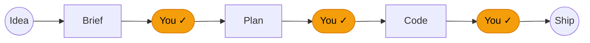

# Documentation Voice

A voice authority for user-facing docs. Decides *how* the prose reads — not how the document is structured (that's `/documentation-standard`) and not whether it's correct (that's `/iterative-review` or `/da-review`, invoked separately by the user).

## When to use

The reader is a developer deciding whether to install, try, or trust a tool. They are skeptical, fast-scanning, and one tab-close away from leaving. Apply when:

- Writing or rewriting a `README.md`.
- Writing per-skill / per-command / per-feature handout pages.
- Drafting user manuals or getting-started guides.
- Reviewing existing docs for "marketing bullshit" and dry-prose drift.
- Writing landing-page copy or feature-bullet rewrites.

## When NOT to use

- Code comments, docstrings, commit messages — different audience, different voice.
- ADRs (Architecture Decision Records) — those are internal-historical, not persuasive.
- API reference auto-generation — preserve precision over voice.
- Internal specs, RFCs, design docs the team writes for itself — internal voice is fine.

---

## The rules

These are voice rules. Apply to user-facing prose only. Adapt phrasing to the project's domain — never copy the literal words from the examples below.

### 1. No marketing bullshit

Forbidden vocabulary: *supercharge, revolutionize, powerful, blazing-fast, game-changer, unleash, seamless, magical, intuitive, simply, just, easy, effortless*. If a sentence would survive being read aloud by a sceptical CTO, it stays. If it would make them roll their eyes, rewrite it.

### 2. Lead with proof, not pitch

Demo GIF, worked example, or one concrete output goes above the fold. Don't make the reader install to find out what the thing does. If you cannot show, describe what one invocation produces in the next sentence.

### 3. One-sentence value prop in bold up top

Format: **what it does + what's at stake, in one breath.** No subordinate clauses stacked three deep. If it takes two sentences, the value prop isn't clear enough yet.

### 4. Sell each feature by the pain it kills, not the feature it adds

Open every bullet with the user's problem; close with the action that resolves it. "Stop staring at a ticket wondering where to start. Breaks the brief into the smallest tasks." Pain first, mechanism second.

### 5. Concrete beats abstract

Diagram beats prose table. Worked example beats feature list. Real output beats described behaviour. If you wrote "for example", show the example.

### 6. State opinions, don't apologise for them

If the project has a point of view, write it as a point of view. *"If that's not your speed, this repo isn't for you."* No hedging with "we feel that perhaps" or "you might want to consider".

### 7. Surface tradeoffs, don't bury them

If a constraint exists, name it next to the benefit. *"Constraints aren't slow — they're the thing that makes the output trustworthy enough to ship."* Don't promise pure upside; the reader will assume there's a catch and trust you less.

### 8. Attribute borrowed ideas

If a principle, design, or wording came from someone else, credit them inline with a link. Honesty signal — and protects you from misattribution claims if a borrowed idea turns out to have a wrinkle.

### 9. Pace with em-dashes, lead with verbs, keep sentences short

Em-dashes for the beat where a comma is too quiet and a period is too loud. Each sentence should fit in one breath. Lead with the verb when possible: *"Builds test-first, reviews itself, commits."*

---

## Before / After gallery

Real rewrites from a documented README investigation. **These illustrate the rules — adapt the voice to your project's domain, don't copy the phrasing.**

### Headline (Rule 6)

**Before** — passive, faintly apologetic, hedges the opinion:
> ## The opinions baked in

**After** — owns the position, invites the reader to disagree:
> ## Why this repo has opinions

### Section opener (Rules 1, 6, 7)

**Before** — dry, no tension, jumps to the list:
> Everything ships with a `CLAUDE.md` that Claude Code loads at the start of every session. It encodes four principles:

**After** — frames the problem, names the tradeoff, then moves to the list:
> Unconstrained AI coding produces verbose, coupled code that accumulates fast and is hard to reverse. Constraints aren't slow — they're the thing that makes the output trustworthy enough to ship.
>
> Everything ships with a `CLAUDE.md` that Claude Code loads at the start of every session. It encodes five principles:

### Feature bullets (Rule 4 — pain-first)

**Before** — feature-first, generic, indistinct from a thousand other CLI READMEs:
> | Command | `feature-refinement` | `/feature-refinement <idea>` | Guides a rough feature idea into a well-scoped Feature Brief ready for planning |
> | Command | `plan-maker` | `/plan-maker <brief>` | Turns a Feature Brief or requirement into a detailed, TDD-ready implementation plan |

**After** — pain first, action second; each bullet is recognisable as a moment the reader has lived:
> - **`/feature-refinement`** — Turn a rough idea into a brief you can hand off. A senior product thinker walks you through the questions you'd otherwise skip.
> - **`/plan-maker`** — Stop staring at a ticket wondering where to start. Breaks the brief into the smallest tasks with tests and dependencies.

### Architecture explanation (Rule 5 — concrete > abstract)

**Before** — table that names the roles but hides the sequence:

| Your part | Claude's part |
|---|---|
| Approve the brief | Refine the idea, challenge it, write the brief |
| Approve the plan | Decompose into smallest tasks, sequence them, choose tests |
| Review the diff | Implement test-first, review itself adversarially, commit one task at a time |

**After** — diagram that shows the flow at a glance:

````

````

> Three human gates, everything else automated.

### Closing line (Rules 6, 9)

**After** — short, opinionated, gives a permission-to-leave to the wrong audience while selling to the right one:
> If that's not your speed, this repo isn't for you. If it is — install in 30 seconds.

### Attribution (Rule 8)

**After** — credits inherited material precisely, calls out original additions:
> Four of these five principles are adapted from [Andrej Karpathy's guidelines](https://github.com/multica-ai/andrej-karpathy-skills/blob/main/skills/karpathy-guidelines/SKILL.md); "Documentation must stay current" is an original addition.

---

## What this skill does NOT do

- **No structure prescription.** Whether your README needs an "Install" section, where headings go, how subdirectories are organised — that's `/documentation-standard`'s job. This skill only governs voice.
- **No review loop.** This skill produces or revises copy; it does not validate it. The user invokes `/iterative-review` or `/da-review` separately if they want adversarial verification — that's the same enforcement path code uses.
- **No translation rules.** If the project is bilingual (e.g. EN + HU), apply the voice in each language independently using a native speaker's idiom. Do not translate the example phrases above literally.
- **No template-filling.** This skill does not ship a README skeleton. Each project's structure is shape-dependent — a CLI README is shaped nothing like a library's.

---

## Companion skills and commands

- **`/documentation-standard`** — structure, organisation, where files go, what sections to include.
- **`/iterative-review`** — adversarial verification of the output (multiple devil's-advocate agents, severity-tagged findings, fix loop). Invoke after applying this skill if you want errors caught the way the source-investigation caught its own.
- **`/da-review`** — single-pass devil's-advocate review without auto-fixes. Lighter alternative to `/iterative-review`.
- **`/aaa`** — benchmarks the output against world-class examples and suggests upgrade paths. Use when "is this good enough?" is the question.
