# Mermaid Diagram Examples

This reference provides examples of common Mermaid diagrams used in documentation.

## Table of Contents
1. [Flowcharts](#flowcharts)
2. [Sequence Diagrams](#sequence-diagrams)
3. [Class Diagrams](#class-diagrams)
4. [Entity Relationship Diagrams](#entity-relationship-diagrams)
5. [State Diagrams](#state-diagrams)
6. [C4 Architecture Diagrams](#c4-architecture-diagrams)

## Flowcharts

### Simple Process Flow
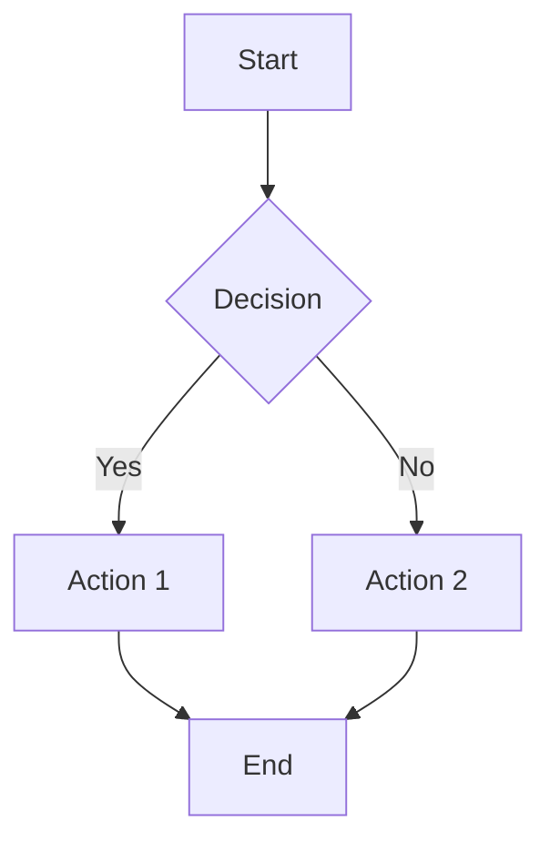

### System Component Flow
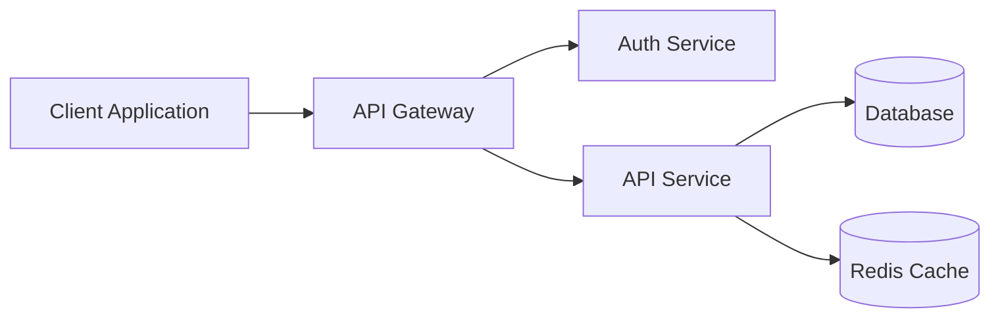

### Error Handling Flow
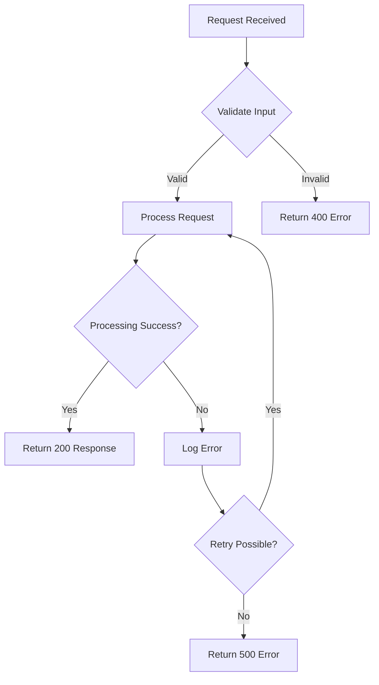

## Sequence Diagrams

### API Request Flow
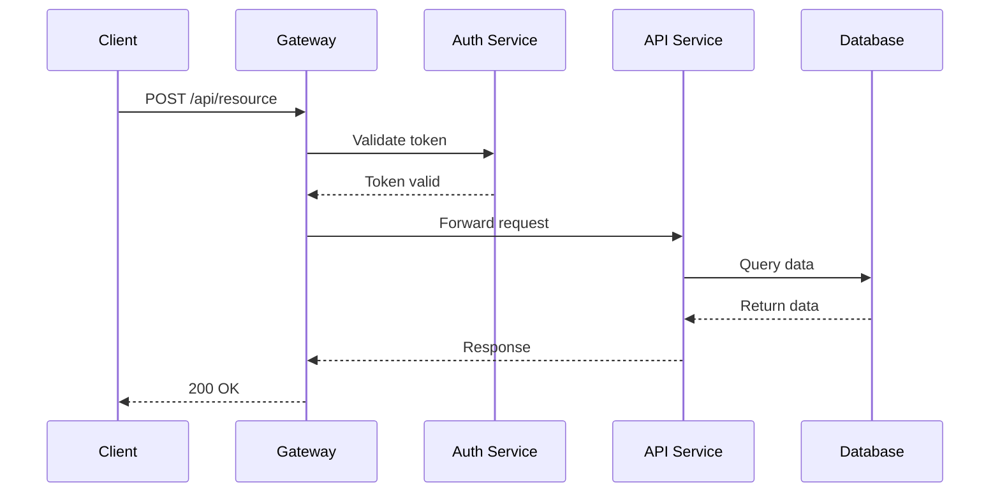

### Authentication Flow
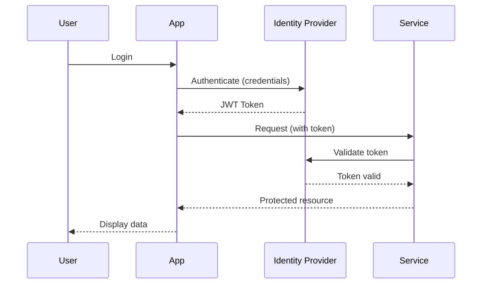

## Class Diagrams

### Domain Model
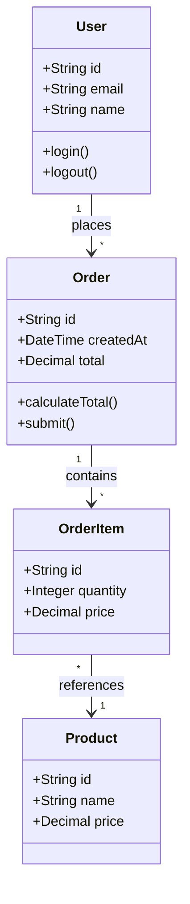

### Service Architecture
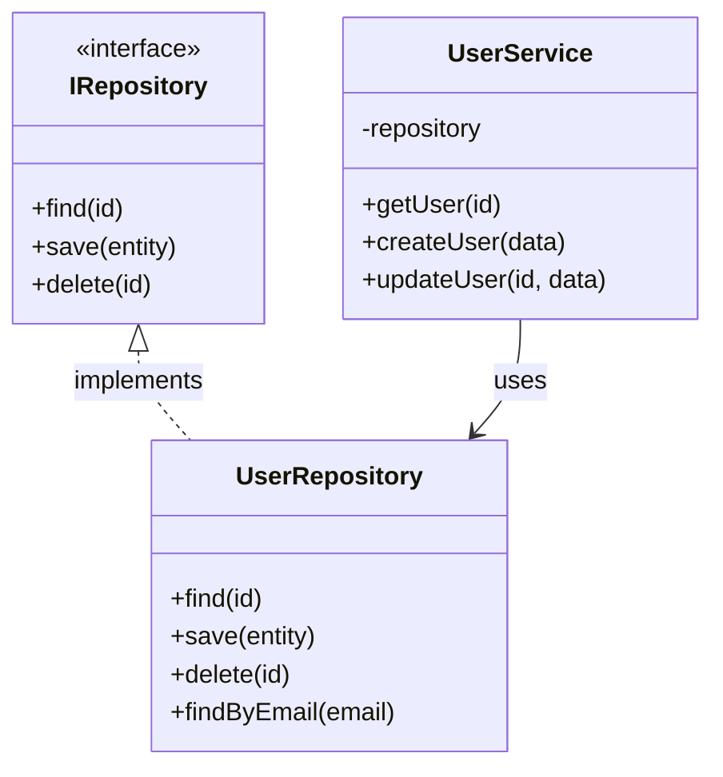

## Entity Relationship Diagrams

### Database Schema
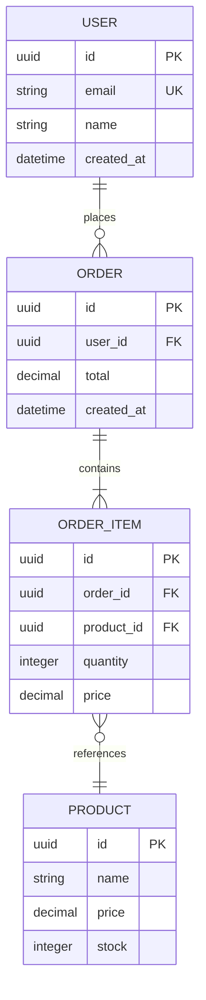

### Multi-Tenant Schema
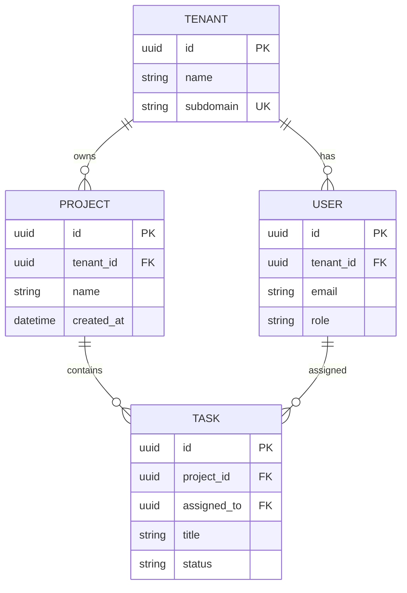

## State Diagrams

### Order Lifecycle
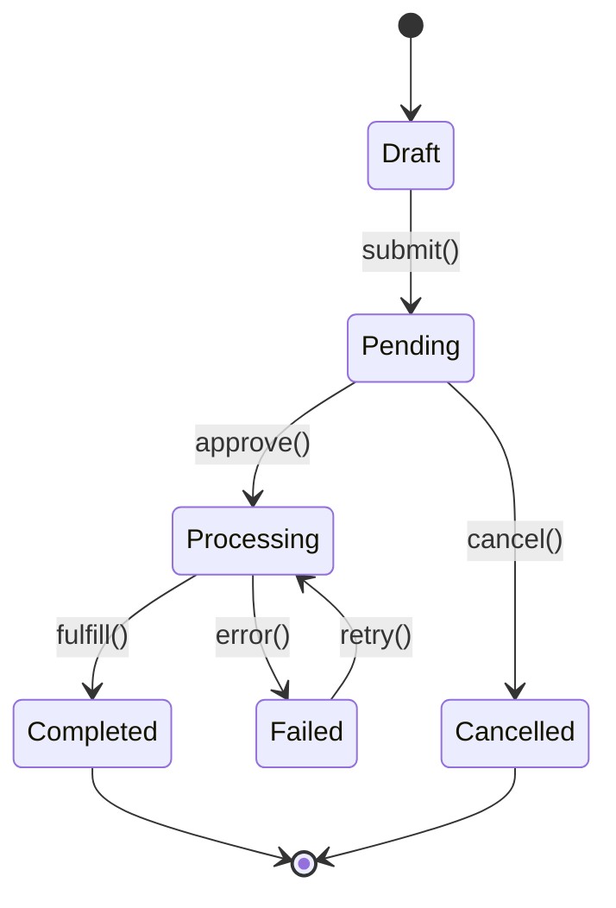

### Connection State Machine
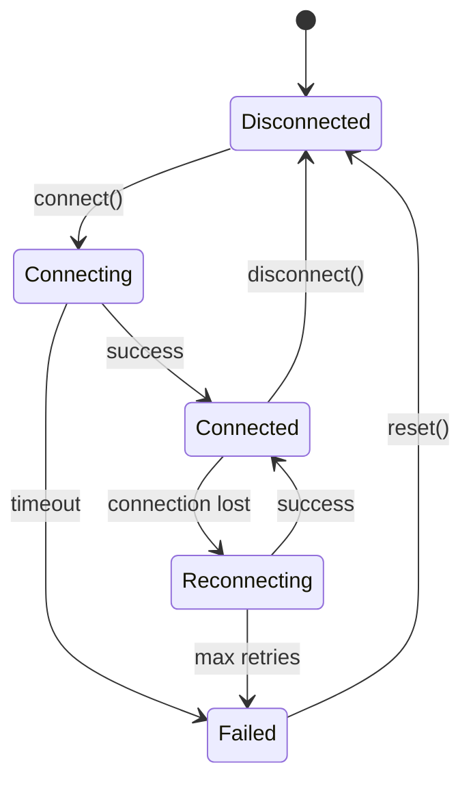

## C4 Architecture Diagrams

### System Context (Level 1)
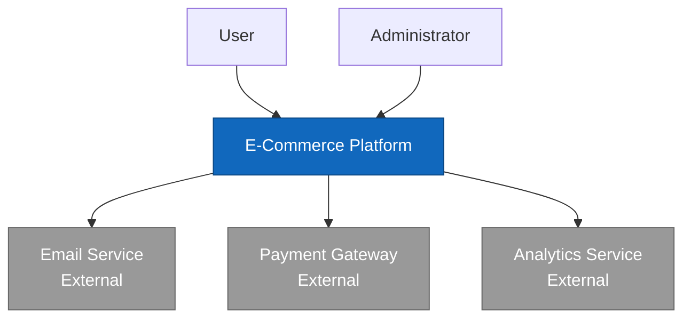

### Container Diagram (Level 2)
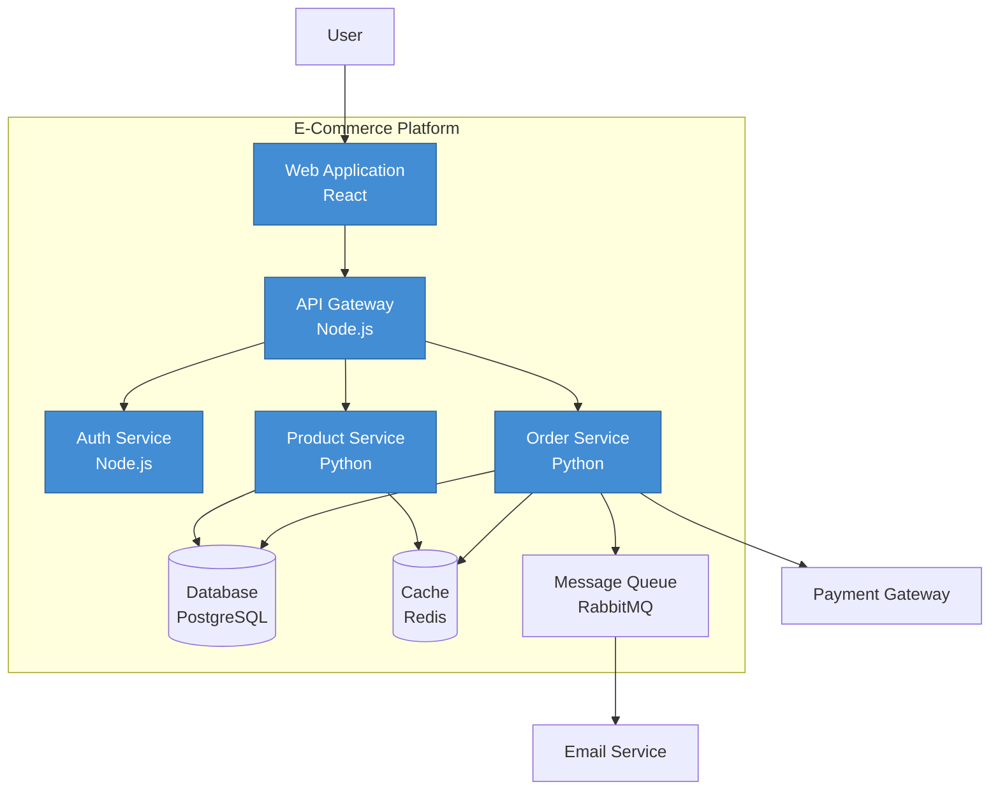

### Component Diagram (Level 3)
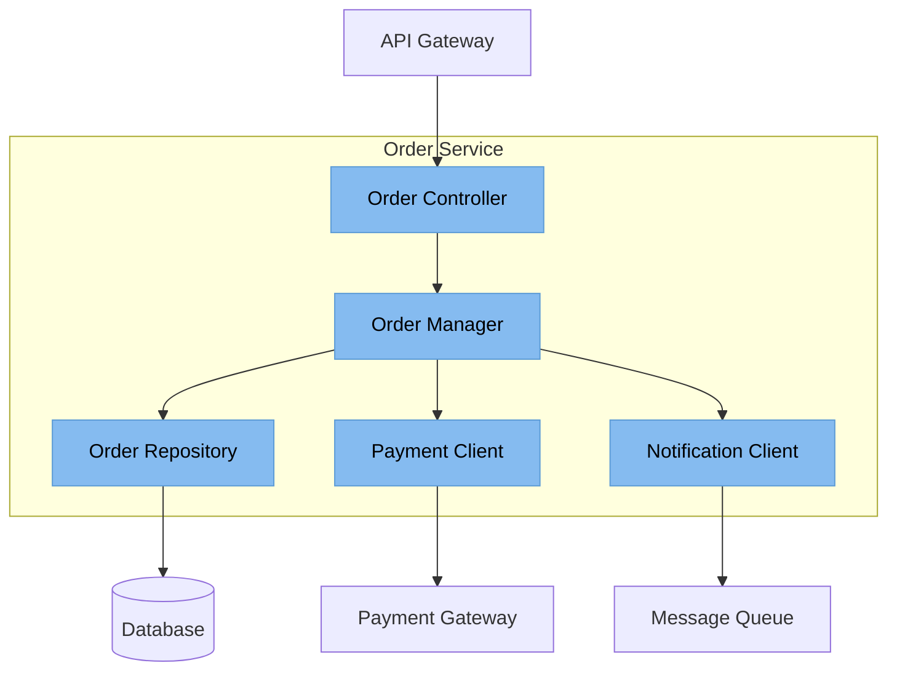

## Deployment Diagrams

### Infrastructure Overview
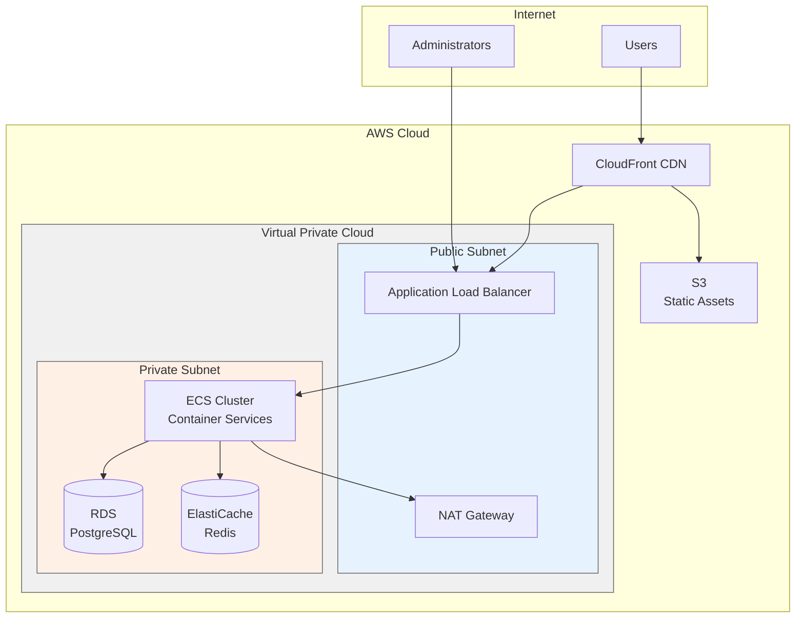

## Tips for Effective Diagrams

1. **Keep it simple**: Focus on essential elements only
2. **Use consistent styling**: Apply same colors/shapes for similar concepts
3. **Label clearly**: Every node should have a descriptive label
4. **Show relationships**: Use appropriate arrows and connectors
5. **Add legends**: When using colors or symbols, explain them
6. **Limit complexity**: Break complex diagrams into multiple simpler ones
7. **Update regularly**: Keep diagrams in sync with code changes

## When to Use Each Diagram Type

- **Flowcharts**: Process flows, decision trees, algorithms
- **Sequence**: API interactions, authentication flows, temporal processes
- **Class**: Domain models, service architecture, inheritance
- **ERD**: Database schemas, data relationships
- **State**: Lifecycle management, connection handling, workflows
- **C4**: System architecture at different zoom levels
